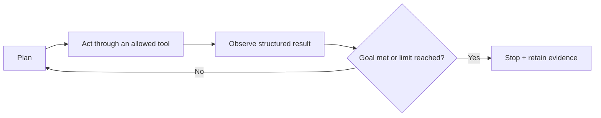
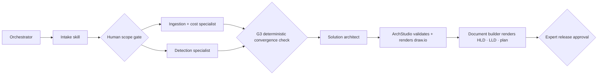
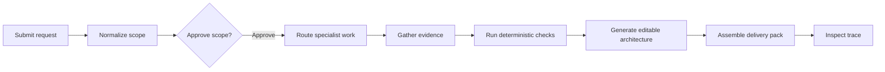

# Governed Agentic AI for Cybersecurity — proof-first simplified session

**Artifact type:** canonical content, visual, animation and interaction specification  
**Target formats:** interactive HTML first; PowerPoint-compatible storyboard second  
**Audience:** cybersecurity practitioners, architects, SOC teams and leaders with limited agentic-AI engineering knowledge  
**Session length:** 60 minutes, including a 10–15 minute demonstration  
**Main-deck length:** 13 pages  
**Relationship to existing content:** revises only the simplified presentation. The 28-page summary and four-session series remain separate and unchanged.  
**Product evidence checked:** local and private GitHub `main` at commit `d7ecd96` on 19 August 2026; Railway `/api/health` returned `{"ok":true,"skills":10}`  
**Verification boundary:** authenticated Railway configuration was not inspected; product screenshots use the current local code with an isolated fake runtime  
**Security catalogue checked:** OWASP Top 10 for LLM Applications 2025, official GenAI Security Project page

---

## 1. Session contract

### Working title

**Governed Agentic AI for Cybersecurity**  
*From repeated work to reviewable deliverables*

### Opening promise

> We built an agentic-AI application to reduce repeated cybersecurity delivery effort. It turns one governed request into a security review, a delivery pack or validated KQL—while retaining gates, evidence and human decisions.

### Audience should leave able to explain

1. What the application delivers and why it matters.
2. Why repeating a large chat prompt is not a maintainable workflow.
3. What changes across chat, persistent instructions, a skill and an agent.
4. What a skill contains beyond instructions.
5. Why an LLM is only one component of an agentic application.
6. Why multiple agents require an orchestrator and explicit handoff artifacts.
7. What the OWASP 2025 Top 10 risks are at overview level.
8. Which controls surround this application today and which remain future work.
9. Why Langfuse and a SIEM answer different but complementary questions.
10. Where the live demonstration pauses, validates and preserves evidence.

### Deliberate exclusions

- Transformer mathematics and model-training detail.
- The earlier Automation → ML → Deep Learning history timeline.
- A feature-by-feature framework catalogue.
- A detailed explanation of all ten OWASP risks.
- XAI as a discipline; reserve it for a future session.
- Claims that planned controls already exist.
- Unmeasured effort-reduction or quality percentages.

---

## 2. Experience direction

### Visual thesis

**A calm cybersecurity command room: authentic product proof first, one speaking point per page, and a controlled system revealed only when it explains the outcome.** The design is a dark operational surface with evidence-blue, verified-teal, approval-amber and risk-coral states. It should feel credible in a security architecture review, not like a generic AI marketing deck.

### Content plan

1. **Prove relevance:** application, outputs and authentic product surface.
2. **Build the mental model:** big prompt problem, persistent context, skill and agent.
3. **Reveal the system:** LLM, runtime, tools, MCP, state and controls.
4. **Scale carefully:** orchestrated specialists and typed handoffs.
5. **Secure the path:** OWASP overview, layered controls and current-versus-next truth.
6. **Operate it:** Langfuse and SIEM.
7. **Demonstrate it:** request, approval, specialist work, validation, artifacts and trace.
8. **Close the loop:** three recall statements and the next-session promise.

### Interaction thesis

Use four memorable interaction families:

1. **Product proof:** switch between three authentic current workspaces and explain only input and output.
2. **Progressive build:** reveal Big Prompt → Persistent context → Skill → Agent.
3. **System boundary:** switch between “LLM only” and “Agentic application”; show Plan → Act → Observe → Repeat or Stop.
4. **Real orchestration:** light up the actual Sentinel handoff from intake through G3, ArchStudio and document rendering.
5. **Security and evidence:** inspect OWASP tiles and application layers, then pause the demo at human approval.

Do not make every visual element clickable. Interaction must change understanding, not merely highlight a border.

### Human attention model

- One dominant teaching statement per page.
- No more than four reveal groups on a page.
- Every technical term receives plain-language wording on first use.
- Use a concrete cybersecurity example before a framework or SDK name.
- Put framework names in notes or reference drawers unless the name changes a decision.
- After two conceptual pages, return to a product or workflow example.
- Use audience prediction at the demo approval gate: “Should this continue?”

### Semantic colour system

| Colour | Meaning | Usage |
|---|---|---|
| Blue | capability and controlled activity | request, orchestrator, runtime |
| Teal | verified and observed | evidence, trace, approved connector |
| Green | completed outcome | accepted artifact, passed check |
| Amber | judgment or pause | approval, unresolved decision |
| Coral | risk or untrusted content | prompt injection, blocked action |
| Purple | next state or deeper assurance | planned controls, next session |

Every state must also use text, border treatment or an icon; colour alone is never the only cue.

### Motion system

- **Scene transition:** old scene disappears in 140–180 ms; incoming scene enters after the old headline is no longer visible. Never crossfade two large headlines.
- **Fragment reveal:** 250–350 ms, 8–12 px movement, no persistent blur.
- **Agentic loop:** 800–1,000 ms per meaningful state.
- **Demo sequence:** 1,000–1,200 ms per stage, or presenter-controlled stepping.
- **Ambient movement:** opening evidence paths and subtle agent-loop pulse only.
- **Reduced motion:** remove continuous movement and travel while preserving state changes.

### Projector and accessibility requirements

- Primary target: 1920×1080, 1440×900 and 1280×720.
- Minimum descriptive copy equivalent: 14 px at 1440×900.
- Minimum metadata equivalent: 12 px at 1440×900.
- No meaningful text at 9–10 px.
- No clipping at 1280×720.
- No horizontal overflow at 390×844.
- Touch targets: 44 px where the public audience may interact on mobile.
- Keyboard operation, visible focus, reduced motion and print-visible fragments.

---

## 3. Narrative timing

| Time | Pages | Teaching job |
|---:|---:|---|
| 0–6 min | 1–2 | Establish deliverables, value and authentic product proof. |
| 6–16 min | 3–4 | Explain the big-prompt problem and progression to reusable capability. |
| 16–25 min | 5–6 | Explain skill anatomy and the LLM-inside-an-application mental model. |
| 25–31 min | 7 | Explain multi-agent coordination through an orchestrator. |
| 31–43 min | 8–10 | Show OWASP Top 10 and the controls implemented or planned. |
| 43–48 min | 11 | Explain Langfuse and SIEM. |
| 48–57 min | 12 | Demonstrate one request from intent to evidence. |
| 57–60 min | 13 | Reinforce recall and open the next-session loop. |

### Leadership-short route

Present Pages **1, 2, 4, 6, 7, 8, 9, 10, 11, 12 and 13**. Pages 3 and 5 remain optional technical depth.

---

## 4. Page-by-page production specification

## Page 1 — What we are delivering

**Chapter:** Opening  
**Time:** 3 minutes  
**Page job:** state the product and value before any AI terminology.  
**Audience takeaway:** this session is about reducing repeated cybersecurity delivery effort with a governed application.

### On-screen copy

**Eyebrow:** The outcome first

**Headline:**  
**One agentic application. Three cybersecurity deliverables.**

**Supporting sentence:**  
Reduce repeated delivery effort by turning one governed request into a security review, a delivery pack or validated KQL—while experts keep approval.

### Dominant visual

A single **Cybersecurity request** enters a controlled surface and branches to:

- **Security review** — findings, evidence checklist and report.
- **Delivery pack** — HLD, LLD, checklist, project plan and editable architecture.
- **KQL studio** — MITRE-mapped queries with mechanical schema validation.

An outer boundary reads:

```text
identity · gates · deterministic checks · human decisions · evidence
```

### Reveal

1. Request and headline.
2. Three outcomes.
3. Control boundary and session route: Understand → Secure → Demo.

### Presenter narrative

- “We are starting with what the application delivers, not with an AI framework.”
- “The optimization target is repeated assembly and coordination; expert decisions remain.”
- “We will understand only the concepts needed to evaluate the application, then demonstrate it.”

---

## Page 2 — What the demo will show

**Chapter:** Product proof  
**Time:** 3 minutes  
**Page job:** provide authentic product proof and set demo expectations.  
**Audience takeaway:** the console currently exposes the same three outcomes described on Page 1.

### Dominant visual

Use the customer-safe, fake-runtime screenshots captured from current `d7ecd96` code:

- `assets/product-security-review.png`
- `assets/product-delivery-packs.png`
- `assets/product-kql-studio.png`

The selector changes the real screenshot rather than illuminating a fabricated dashboard. De-emphasize the temporary presenter identity and retain the genuine product copy.

Three numbered selectors:

1. **Security review** — artifact in, findings and evidence out.
2. **Sentinel delivery pack** — scoping notes in; HLD, LLD, checklist, plan and editable architecture out.
3. **KQL studio** — detection intent in; MITRE-mapped, schema-checked queries out.

### Bottom rail

```text
10 skills · 253 tests collected in the repository audit · no live cloud write actions in Phase 1
```

### Interaction

Click one of three selectors to change the current product screenshot and show its input/output in plain language.

### Product-truth note

The screenshots are from a clean local instance using fake fixtures. They show the authentic current product surface but not a live model run. Make this distinction visible in speaker notes.

---

## Page 3 — Better prompt, still a manual process

**Chapter:** From chat to capability  
**Time:** 4 minutes  
**Page job:** show how a prompt grows from a simple request into a structured instruction bundle, while the user still carries the repeated process.  
**Audience takeaway:** better prompts improve the answer, but they do not create a repeatable workflow.

### Headline

**Better prompts improve the answer. They do not create a repeatable workflow.**

### Dominant visual

An animated Sentinel security-review request grows vertically:

```text
USER REQUEST          Review this Sentinel architecture
+ SYSTEM INSTRUCTIONS Role · rules · expected behaviour
+ REFERENCE CONTEXT   Architecture · standards · requirements
+ EXPECTED OUTPUT     Findings · ratings · validation checklist
──────────────────────────────────────────────────────────────
= a better, structured review draft
```

When the next engagement arrives, reveal the repeated operating work:

```text
Project 01: build the method
Project 02: copy + edit it
Project 03: copy + check again
```

The right side shows only three recurring limitations:

- **Repeat setup:** instructions, references and checks are copied or reconstructed.
- **Method drift:** small prompt changes can alter how the review is performed.
- **Manual control:** the user still selects inputs, invokes tools, validates results and manages approval.

### Reveal

1. Small user request.
2. System instructions, reference context and expected output appear.
3. The structured review result appears.
4. Three repeated project steps appear without percentages.
5. Bridge statement: **The prompt contains the method. The method is not yet a managed capability.**

### Accuracy wording

Do not imply chat is weak. Say: “Chat is excellent for reasoning, transformation and drafting; it is not, by itself, the complete delivery workflow.”

---

## Page 4 — Move repeated work into the system

**Chapter:** From chat to capability  
**Time:** 5 minutes  
**Page job:** resolve Page 3 by showing where recurring context, methodology and bounded execution should live.  
**Audience takeaway:** remember the context, package the method, and use an agentic application only when controlled execution is required.

### Headline

**Move what repeats from the prompt into the system.**

Supporting line: **Remember the context. Package the method. Control the execution.**

### Progression

| Stage | Visible promise | Where the work lives | Cybersecurity example | Human role |
|---|---|---|---|---|
| Chat | Answer once | User supplies request, method and context | Draft one Sentinel security review | Provide everything and verify |
| Persistent context | Remember the background | System remembers recurring instructions and knowledge | Reuse standards, terminology and report structure | Provide engagement inputs and verify |
| Skill | Reuse the method | Versioned playbook with templates, checks and scripts | Apply the security-architect method consistently | Own and approve the method |
| Agentic application | Execute bounded steps | Application uses tools, state and approval | Collect evidence → run checks → request approval → produce artifacts | Approve consequential decisions |

Vendor examples such as Claude Projects and custom GPTs belong in speaker notes as familiar examples of configured persistent context. Product capabilities vary, so they are not definitions.

### Interaction

Selecting a stage answers:

1. Where does the repeated work live?
2. What does that mean for a cybersecurity review?
3. What remains the human role?

Final reveal: **Less repeated setup. More consistent delivery. Human accountability remains.**

### Presenter wording

- **Skill:** “A reusable operating playbook the application loads for a task.”
- **Agent:** “A model inside a controlled software loop that can choose the next allowed step.”

---

## Page 5 — Skill anatomy

**Chapter:** Reusable expertise  
**Time:** 5 minutes  
**Page job:** make a skill concrete and show that it can include deterministic assets.  
**Audience takeaway:** a skill is not merely another long prompt.

### Headline

**A skill packages expert work as a reviewable operating playbook.**

### Dominant visual

Interactive x-ray of the current `security-architect` pattern:

```text
security-architect/
├── SKILL.md        scope · triggers · method · boundaries
├── references/     standards · evidence guidance · product facts
├── templates/      finding · report · checklist structures
├── schemas/        machine-checkable input and output contracts
└── scripts/        repeatable validation and rendering
```

### Execution strip

```text
Match request → Load playbook → Read needed references → Run checks → Return typed result
```

### Interaction

Clicking a file or folder reveals one cybersecurity example. Clicking `scripts/` must visibly run a short deterministic validation animation rather than only changing a border.

### Presenter narrative

- “The LLM handles judgment and language; code handles checks that should be repeatable.”
- “The skill is versioned and reviewable like code.”
- “The skill does not grant credentials or authority. The runtime remains responsible.”

### Reference

- [Claude Agent Skills overview](https://platform.claude.com/docs/en/agents-and-tools/agent-skills/overview)

---

## Page 6 — A model becomes an agent

**Chapter:** Agentic AI  
**Time:** 6 minutes  
**Page job:** give one repaired definition that separates an LLM, a single agent and a multi-agent system.  
**Audience takeaway:** the same reasoning core becomes agentic only when a controlled application can plan, act, observe and repeat or stop.

### Headline

**A model becomes an agent when it gains a controlled loop.**

### Dominant visual

The complete outer boundary is **Agentic application**. At the centre is **LLM**. Use only four surrounding parts:

- **Goal + skills** — purpose, method and boundaries.
- **Tools + MCP** — approved actions and context connections.
- **State + memory** — progress, artifacts and evidence.
- **Controls** — limits, validation and human approval.

On the right, show a three-level comparison:

1. **LLM:** answers one prompt and normally stops.
2. **Single agent:** owns one goal and repeats under runtime controls.
3. **Multi-agent system:** an orchestrator coordinates genuinely separate specialist roles.

### Controlled flow



### Interaction

- **LLM only:** all outer components dim; result is “draft inside conversation.”
- **Agentic application:** components connect in sequence.
- **Show blocked action:** LLM proposes a write-capable operation; policy stops execution and requests approval.

### Accuracy note

MCP is a connection protocol used by an AI host to reach tools, resources or prompts exposed by a server. It is not the agent, memory or security boundary by itself.

### References

- [Model Context Protocol architecture](https://modelcontextprotocol.io/docs/learn/architecture)
- [OpenAI Agents SDK](https://openai.github.io/openai-agents-python/)

---

## Page 7 — The real product orchestration

**Chapter:** Our orchestration  
**Time:** 5 minutes  
**Page job:** map the repaired multi-agent definition to the actual Sentinel delivery implementation.  
**Audience takeaway:** the orchestrator coordinates expertise, while deterministic code checks handoffs and renders the costly artifacts.

### Headline

**The orchestrator coordinates expertise. Code checks the handoffs.**

### Dominant visual



Under the pipeline, reveal three verified proof points:

- **Five real conflicts caught:** the golden G3 run found collection↔detection disagreements and routed them back.
- **Resume, do not restart:** completed model work is skipped after interruption.
- **Deterministic outputs:** documents, diagrams and manifests are rendered by code.

### Interaction

- **Run the handoff:** light up the ten displayed steps sequentially and end with retained artifacts, checks, lineage and approval state.

### Presenter narrative

- “The model is used where expert judgment is needed; code is used where a repeatable check or render is possible.”
- “The five-conflict result is the quality story. The speed claim alone is not the product.”
- “ArchStudio is a deterministic tool in this workflow, not another free-running agent.”

---

## Page 8 — OWASP Top 10 for LLM Applications 2025

**Chapter:** AI application security  
**Time:** 5 minutes  
**Page job:** show the complete current risk catalogue without turning the session into ten lectures.  
**Audience takeaway:** security risk exists across input, data, dependencies, output, authority and operations.

### Headline

**Useful AI applications create new attack paths. OWASP gives us a shared checklist.**

### Ten-box grid

1. **LLM01 Prompt Injection**
2. **LLM02 Sensitive Information Disclosure**
3. **LLM03 Supply Chain**
4. **LLM04 Data and Model Poisoning**
5. **LLM05 Improper Output Handling**
6. **LLM06 Excessive Agency**
7. **LLM07 System Prompt Leakage**
8. **LLM08 Vector and Embedding Weaknesses**
9. **LLM09 Misinformation**
10. **LLM10 Unbounded Consumption**

### Visual grouping

Use subtle background bands, not separate extra cards:

- **Input and knowledge:** 01, 02, 04, 08.
- **Software and dependencies:** 03, 05.
- **Authority and operations:** 06, 07, 09, 10.

### Interaction

Click a box to reveal:

- one sentence in plain language;
- where it appears in an agentic application;
- one design response;
- whether the demo directly illustrates it.

Default focus: **Prompt Injection**. Presenter should also select **Improper Output Handling**, **Excessive Agency** and **Sensitive Information Disclosure**. Do not explain all ten unless asked.

### Reference

- [OWASP Top 10 for LLM Applications 2025](https://genai.owasp.org/llm-top-10/)

---

## Page 9 — The governed agentic stack

**Chapter:** Secure by design  
**Time:** 5 minutes  
**Page job:** show where technologies belong without teaching a framework catalogue.  
**Audience takeaway:** security and auditability are cross-cutting properties across every application layer.

### Headline

**Security and traceability cross every layer.**

### Ten-layer visual

List the layers on the left and display one plain-language inspector on the right:

1. UI
2. API
3. Orchestration
4. Agent runtime
5. Models
6. Tools / data
7. State / memory
8. Observability
9. Evals
10. Guardrails

Use a coral left rail, **Security · may it do this?**, and a teal right rail, **Auditability · what happened?**. The presenter normally clicks only UI, Orchestration, Tools/Data and Guardrails.

Each inspector contains:

- the verified current product choice;
- what the layer does;
- one security question;
- the audit records expected from the layer.

End with:

> The model can change. The governed control system is the durable asset.

### Framework positioning

- NIST AI RMF / GenAI Profile: risk governance.
- OWASP Top 10: application threat catalogue.
- This page: engineering control architecture.
- Technologies: implementation choices, not the framework itself.

### References

- [NIST AI Risk Management Framework](https://www.nist.gov/itl/ai-risk-management-framework)
- [NIST AI 600-1 Generative AI Profile](https://doi.org/10.6028/NIST.AI.600-1)

---

## Page 10 — What the product uses today

**Chapter:** Product security truth  
**Time:** 5 minutes  
**Page job:** distinguish verified current controls from planned improvements.  
**Audience takeaway:** the MVP already includes several security layers, while stronger enterprise controls remain explicit future work.

### Headline

**Secure by design means showing what is enforced now—and what is not yet.**

### Current controls verified in the repository

- Accounts, signed sessions, per-user quota and sign-in rate limiting.
- Owner-scoped engagements.
- LangGraph/YAML orchestration with gates, revision limits and human pauses.
- Structured model output and per-node token budgets.
- MCP/evidence connector hostname allowlists; current knowledge connectors are read-only.
- Output schemas, fail-closed gates and no self-approval.
- KQL table/column validation and other deterministic gates.
- Append-only journal and artifact manifest with hashes, lineage and approval metadata.
- Optional Langfuse tracer integration for users, sessions, scores and skill provenance; prompt/response capture is opt-in and off by default.
- Locked dependencies, Dependabot, 253 collected tests, lint, lock verification and container smoke checks.
- No live cloud write actions in Phase 1.

### Next controls—must remain visibly labelled planned

- Entra ID SSO/MFA and stronger tenant isolation.
- Per-account API rate limits and provider spend caps.
- Prompt-injection screening of uploaded documents.
- Policy-as-code for tool actions using OPA/Cedar or equivalent.
- SIEM export for selected security events.
- SBOM, vulnerability scan, image signing and non-root runtime.
- Evaluation-gated model upgrades, automated judge datasets and alerting.

### Interaction

Toggle **Running today** and **Next security layer**. Planned items use dashed purple treatment and never appear green.

### Product-truth boundary

This page is based on local and private GitHub `main` at `d7ecd96`. Railway `/api/health` returned ten skills; authenticated Railway configuration was not inspected. Re-check before every external delivery.

---

## Page 11 — Langfuse and SIEM

**Chapter:** Observe and respond  
**Time:** 5 minutes  
**Page job:** answer the likely SOC question directly.  
**Audience takeaway:** use Langfuse to understand the AI workflow and a SIEM to correlate security events across the environment.

### Headline

**Langfuse explains the AI run. The SIEM explains the security event. Use both.**

### Comparison

| Langfuse / AI observability | SIEM / security operations |
|---|---|
| model, agent, tool and retrieval spans | identity, application, cloud and network events |
| prompt/version context and structured output | cross-source correlation and detection |
| latency, tokens, cost and failure point | alert, incident, investigation and response |
| sessions, users, scores and evaluation | retention, compliance and security operations |

### Security event bridge

Forward compact events such as:

- policy denial;
- repeated injection signal;
- attempted approval bypass;
- unusual tool use;
- abnormal cost or volume;
- trace ID, session ID and approval ID.

Do not indiscriminately duplicate full prompts, responses, retrieved data or tool payloads into the SIEM.

### Interaction

1. **Trace a run** animates the AI workflow.
2. **Send security signal** forwards a compact event and trace ID.
3. A visible label states: **Langfuse is not a SIEM replacement.**

### Reference

- [Langfuse observability](https://langfuse.com/docs/observability/overview)

---

## Page 12 — Demonstration

**Chapter:** Demo  
**Time:** 9 minutes  
**Page job:** prove value and controls through one understandable workflow.  
**Audience takeaway:** the deliverable is only credible when the request, decisions, checks, artifacts and trace remain connected.

### Headline

**Follow one request from intent to reviewed evidence.**

### Primary scenario

> Design a Microsoft Sentinel platform for a hybrid customer. Produce the HLD, LLD, project plan and editable architecture. Show assumptions, unresolved decisions and validation evidence.

### Demo flow



### Rehearsal interaction

1. **Start run** normalizes scope.
2. Workflow pauses at **Approve scope**.
3. Ask: “Should this continue without a decision?”
4. Approval starts one stage every 1–1.2 seconds.
5. Artifacts appear: `HLD.docx`, `LLD.docx`, `project-plan.xlsx`, `architecture.drawio`, `manifest.json`.
6. **Inspect trace** opens model, tool, gate, duration, output and correlation metadata.

### Live demo discipline

- Open one generated artifact, not every file.
- Show one deterministic check.
- Show one human decision.
- Show the corresponding Langfuse trace.
- State clearly when the presentation uses a rehearsal simulation rather than the live backend.

---

## Page 13 — Close and next session

**Chapter:** Closing  
**Time:** 3 minutes  
**Page job:** create recall and make the audience expect the next session.  
**Audience takeaway:** package expertise, bound action and preserve evidence.

### Headline

**Package expertise. Bound action. Preserve evidence.**

### Three recall statements

1. **Skill:** reusable operating playbook.
2. **Orchestrator:** controlled multi-step coordination.
3. **Security + observability:** defensible action and evidence.

### Teach-back question

> What belongs in the skill, what belongs in the orchestrator, and what must remain a human decision?

### Next-session hook

**Build and Secure Your First Cybersecurity Agent**

Move from useful MVP to policy-aware assurance: tenant isolation, policy-as-code, adversarial testing, evaluation datasets, SIEM correlation and controlled write actions.

Do not introduce XAI on this page.

### Interaction

- Clicking a recall statement reveals one concrete example, not only a border highlight.
- **Start this session again** performs a true reset.
- **Explore the Learning Hub** links to `/`.

---

## 5. Plain-language glossary

The Help panel must include this glossary:

| Term | Audience-friendly definition |
|---|---|
| LLM | The language model that generates or transforms text and code from context |
| Skill | A reusable operating playbook containing instructions, references and deterministic assets |
| Agent | A model inside a controlled loop that can choose the next allowed step |
| Tool | An approved function or service the application may execute |
| MCP | A standard connection method through which a server exposes tools or context |
| Runtime | Software that manages model turns, tool requests, limits and structured results |
| Orchestrator | Workflow controller for order, state, routing, retries and approval pauses |
| State | Saved workflow progress, decisions and evidence |
| Guardrail | A rule or check constraining input, output or action |
| Deterministic check | Repeatable code that gives the same result for the same input |
| Trace | A time-ordered record of the application run |
| SIEM | Security platform for correlating events, alerts, investigations and response |

---

## 6. HTML production requirements

### Route

`/presentations/governed-agentic-ai/simplified/index.html`

### Required interactions

- Fragment reveal and reverse reveal.
- Table of contents, notes, references, help and fullscreen.
- Page 2 product screenshot inspector.
- Page 4 progression inspector.
- Page 5 skill x-ray with meaningful script animation.
- Page 6 LLM-only / agentic-system toggle and blocked action.
- Page 7 real-product handoff animation.
- Page 8 all ten OWASP tiles and inspector.
- Page 9 ten-layer stack inspector with security and auditability rails.
- Page 10 current / next toggle.
- Page 11 trace-to-SIEM bridge.
- Page 12 demo with approval pause, paced stages and trace modal.
- Page 13 recall examples and true restart.

### Link fixes

- Home icon may link to `/presentations`.
- “Explore the Learning Hub” must link to `/`, not the older summary presentation.
- External references open in a new tab with `rel="noreferrer"` or `noopener noreferrer`.

### Acceptance criteria

- No scene-to-scene headline overlap at any point in normal motion.
- Zero console errors during a complete run.
- All interactive controls work by keyboard and pointer.
- No clipping at 1920×1080, 1440×900 or 1280×720.
- No horizontal overflow at 390×844.
- All public/mobile touch controls are at least 44 px high.
- Reduced-motion mode preserves every state and all information.
- Restart clears page, fragments, timers, inspectors and demo state.
- Product screenshot contains no customer data, secrets or live prompt payloads.

---

## 7. PowerPoint mapping

| HTML behaviour | PowerPoint equivalent |
|---|---|
| Fragment reveal | Appear/Fade build |
| Product screenshot callout | Emphasis pulse and crop zoom |
| Progression inspector | Duplicate Morph slides |
| Skill x-ray | Five builds or Morph states |
| LLM/agentic toggle | Two Morph states |
| Real orchestration handoff | Sequential emphasis across the actual pipeline |
| OWASP tile inspector | One overview plus optional hidden detail slides |
| Ten-layer stack inspector | Duplicate Morph states for the four presenter-selected layers |
| Current/next toggle | Two Morph states with a persistent legend |
| Trace and demo run | Screen recording or sequential emphasis |
| Restart | Hyperlink to Slide 1 |

Keep 13 visible main slides. Hidden supporting states do not change the visible table of contents.

---

## 8. Fact-check and terminology rules

1. Say **agentic application**, not “the LLM is the agent.”
2. Say the model **proposes** a tool request; the application checks and executes it.
3. Explain MCP as a protocol, not as memory, RAG, an agent or a security boundary.
4. Explain skills as the implementation pattern used here; platforms differ.
5. Explain an orchestrator by what it owns before naming LangGraph.
6. Explain OWASP as a threat catalogue and NIST as risk governance.
7. Do not call Langfuse a SIEM replacement or an authoritative audit ledger.
8. Distinguish probabilistic model judgment from deterministic software checks.
9. Separate verified product controls from roadmap intent visually and verbally.
10. Avoid “fully secure,” “all required controls” and similar absolute claims.
11. Avoid exact effort savings unless demonstrated by measured product evidence and appropriately qualified.
12. State that the authentic product screenshots use a clean fake-runtime instance.

---

## 9. Primary reference set

- [NIST AI Risk Management Framework](https://www.nist.gov/itl/ai-risk-management-framework)
- [NIST AI 600-1: Generative Artificial Intelligence Profile](https://doi.org/10.6028/NIST.AI.600-1)
- [OWASP Top 10 for LLM Applications 2025](https://genai.owasp.org/llm-top-10/)
- [Model Context Protocol architecture](https://modelcontextprotocol.io/docs/learn/architecture)
- [OpenAI Agents SDK](https://openai.github.io/openai-agents-python/)
- [LangGraph overview](https://docs.langchain.com/oss/python/langgraph/overview)
- [Claude Agent Skills overview](https://platform.claude.com/docs/en/agents-and-tools/agent-skills/overview)
- [Langfuse observability](https://langfuse.com/docs/observability/overview)
- [Kusto Query Language overview](https://learn.microsoft.com/en-us/kusto/query/?view=microsoft-fabric)

---

## 10. Definition of done

The simplified presentation is ready when:

1. The first two pages establish product value and authentic proof before AI terminology.
2. A beginner can explain Chat → Persistent context → Skill → Agentic application.
3. The LLM is visibly contained inside a larger controlled system.
4. Multi-agent work visibly uses an orchestrator and explicit artifacts.
5. All ten OWASP 2025 risks appear with their official names.
6. The audience sees current security controls and planned controls as separate states.
7. Langfuse and SIEM have distinct, complementary responsibilities.
8. The demo pauses for a real human decision and produces reviewable artifacts plus a trace.
9. All browser, viewport, accessibility, interaction and restart checks pass.
10. The 28-page summary and four-session series remain unchanged.
